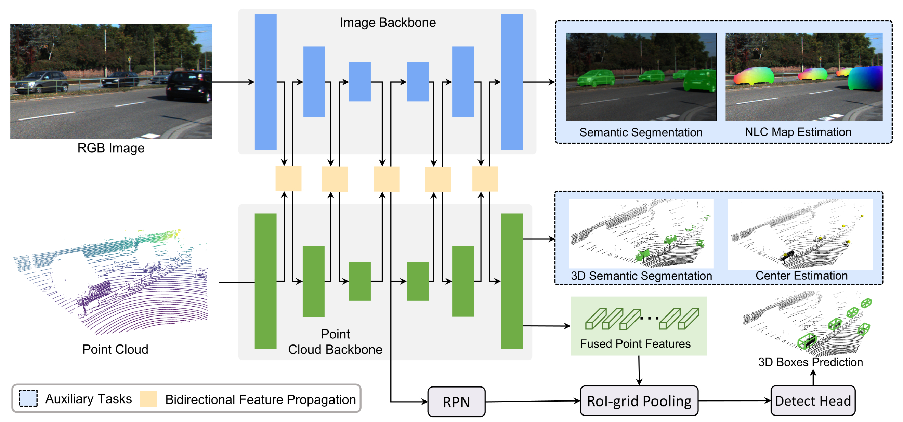

<!--  -->

# Bidirectional Propagation for Cross-Modal 3D Object Detection (ICLR2023)



This is the official implementation of "Bidirectional Propagation for Cross-Modal 3D Object Detection" [`[paper]`](https://openreview.net/forum?id=gYs_cRuK7V&referrer=%5BAuthor%20Console%5D(%2Fgroup%3Fid%3DICLR.cc%2F2023%2FConference%2FAuthors%23your-submissions)). This repository is based on [`[OpenPCDet]`](https://github.com/open-mmlab/OpenPCDet).


## Overview
- [Installation](#Installation)
- [Pretrained Models](#pretrained-models)
- [Getting Started](#getting-started)
- [License](#license)
- [Acknowledgement](#acknowledgement)
<!-- - [Contribution](#contribution) -->
<!-- - [Citation](#citation) -->

## Installation

Please refer to [INSTALL.md](docs/INSTALL.md) for the installation instruction.

## Pretrained-models
Here we present the 3D detection performance of moderate difficulty on the *val* set of KITTI dataset.

* The pre-trained model is trained with 4 NVIDIA 3090Ti GPUs and are available for download.
* The training time is measured with 4 NVIDIA 3090Ti GPUs and PyTorch 1.8.

|                                             | training time | Car@R40 | Pedestrian@R40 | Cyclist@R40   | download |
|---------------------------------------------|:----------:|:-------:|:-------:|:-------:|:---------:|
| [BiProDet](tools/cfgs/kitti_models/biprodet.yaml) |~8 hours| 86.21 | 67.87 | 76.17 | [model-286M](https://drive.google.com/file/d/1E2eA1_jeuvOF2XCC_orD9y93QbSaPSgy/view?usp=sharing) |

## Getting Started

### Prepare KITTI Dataset
* Please download the official [KITTI 3D object detection](http://www.cvlibs.net/datasets/kitti/eval_object.php?obj_benchmark=3d) dataset and organize the downloaded files as follows (the road planes could be downloaded from [[road plane]](https://drive.google.com/file/d/1d5mq0RXRnvHPVeKx6Q612z0YRO1t2wAp/view?usp=sharing), which are optional for data augmentation in the training):
<!-- * If you would like to train [CaDDN](../tools/cfgs/kitti_models/CaDDN.yaml), download the precomputed [depth maps](https://drive.google.com/file/d/1qFZux7KC_gJ0UHEg-qGJKqteE9Ivojin/view?usp=sharing) for the KITTI training set -->
<!-- * NOTE: if you already have the data infos from `pcdet v0.1`, you can choose to use the old infos and set the DATABASE_WITH_FAKELIDAR option in tools/cfgs/dataset_configs/kitti_dataset.yaml as True. The second choice is that you can create the infos and gt database again and leave the config unchanged. -->

```
OpenPCDet
├── data
│   ├── kitti
│   │   │── ImageSets
│   │   │── training
│   │   │   ├──calib & velodyne & label_2 & image_2 & planes
│   │   │── testing
│   │   │   ├──calib & velodyne & image_2
├── pcdet
├── tools
```

* Generate the data infos by running the following command: 
```python 
python -m pcdet.datasets.kitti.kitti_dataset create_kitti_infos tools/cfgs/dataset_configs/kitti_dataset.yaml
```
Especially, for the 2D auxiliary task of semantic segmentation, we used the instance segmentation annotations as provided in [KINS dataset](https://github.com/qqlu/Amodal-Instance-Segmentation-through-KINS-Dataset). We incorporate mask of instance segmentation in kitti_infos_train/val.pkl and kitti_dbinfos_train.pkl. Please download them in this [link](https://drive.google.com/drive/folders/1cyFt9MqHnKK620IKbRuTN6SiEvJP6r8d?usp=sharing) and replace the original files.

### Training
```
cd tools;
python train.py --cfg_file ./cfgs/kitti_models/biprodet.yaml
```
Multi gpu training, assuming you have 4 gpus:

```
CUDA_VISIBLE_DEVICES=0,1,2,3 bash scripts/dist_train.sh 4 --cfg_file ./cfgs/kitti_models/biprodet.yaml

```
### Testing
```
cd tools/
```
Single gpu testing for all saved checkpoints, assuming you have 4 gpus:
```
python test.py --eval_all --cfg_file ./cfgs/kitti_models/biprodet.yaml
```

Multi gpu testing for all saved checkpoints, assuming you have 4 gpus:
```
CUDA_VISIBLE_DEVICES=0,1,2,3 bash scripts/dist_test.sh 4 --eval_all --cfg_file ./cfgs/kitti_models/biprodet.yaml
```

Multi gpu testing a specific checkpoint, assuming you have 4 gpus and checkpoint_39 is your best checkpoint :
```
CUDA_VISIBLE_DEVICES=0,1,2,3 bash scripts/dist_test.sh 4  --cfg_file ./cfgs/kitti_models/biprodet.yaml --ckpt ../output/biprodet/default/ckpt/checkpoint_epoch_80.pth
```

<!-- ## Pretrained Models -->

## License

`BiProDet` is released under the [Apache 2.0 license](LICENSE).

## Acknowledgement
Thanks for the OpenPCDet, the implementation of probabilistic object detectors part is mainly based on the pcdet v0.5.2.


## Citation
If you find this work useful in your research, please consider cite:
```
@inproceedings{
    zhang2023bidirectional,
    title={Bidirectional Propagation for Cross-Modal 3D Object Detection},
    author={Yifan Zhang and Qijian Zhang and Junhui Hou and Yixuan Yuan and Guoliang Xing},
    booktitle={International Conference on Learning Representations},
    year={2023}
}
```


